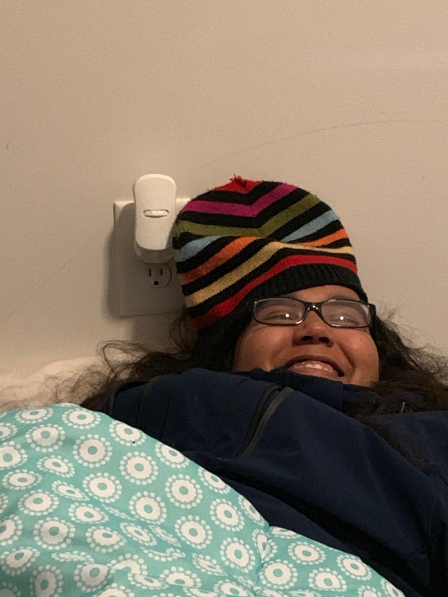

# 4180project - Sketches using the Rasberry Pi
# by: William Harrer, Maria Padilla Fuentes, Arianne Perez, Ethan Vargas

1. Brief Description of Design Project:

Our team’s design project will be a robotic drawing machine that makes use of a linear motion kit (available in the lab) that moves a pen along an x- and y-axis to draw a picture. A user-provided grayscale image is processed to produce a series of (x,y)-coordinates; these coordinates will be used to command the servos and draw a version of the image using one continuous line. The image processing and servo control will all be done using a Pi 3, and a camera that can be used to take pictures that can be processed and drawn will be connected. A simple GUI will also be provided that allows users to choose which image they would like to have drawn. 
2. List any closely related projects (URLs) and describe how your project will be different or improved.

https://github.com/SuperMakeSomething/robotic-drawing-machine

Our project will use the image-parsing code and physical set-up of this project (a robotic drawing machine) in order to provide the same functionality. However, our project will use a linear motion kit (instead of a system created from scratch) and the Pi 3 (instead of an Arduino). Also, our project will streamline the entire process by allowing a picture to be taken with a camera connected to the Pi, processing that image natively on the Pi, and then commanding the servos to draw a one-line version of that image. The robotic drawing machine project did not do this, requiring the user to process an image on a different device using Matlab and then transfer the newly created file to the Arduino via an SD card.
3. If you need any parts or software not available in the lab or in your parts kit, what is your plan to obtain the parts quickly (within 10 days)?
Most of the required parts (as listed in the project that we are building off of and the parts that we will use to replace some components) are available in the lab and/or invention studio. For additional materials, we can make a trip to home depot.

## Proof I can add a picture

## Components
- [Raspberry Pi 3 Model B](https://www.raspberrypi.org/products/raspberry-pi-3-model-b/)
- [Raspberry Pi Camera Module V2](https://www.raspberrypi.org/products/camera-module-v2/)
- [mbed](https://os.mbed.com/platforms/mbed-LPC1768/)
- [Fingerprint Scanner](https://os.mbed.com/users/beanmachine44/notebook/fingerprint-scanner1/)
- [SD Card Reader](https://os.mbed.com/cookbook/SD-Card-File-System)
- [Speaker](https://os.mbed.com/users/4180_1/notebook/using-a-speaker-for-audio-output/)
- [Class D Audio Amp](https://os.mbed.com/users/4180_1/notebook/tpa2005d1-class-d-audio-amp/)

## Pictures
- Fingerprint scanner setup, enrollment, and successful scan
-   
- Raspberry Pi Camera setup, mbed connection, and website GUI
-   
- Terminal showing website traffic 
- Website Console 

## Demo Video

## Future Work
- Store multiple fingerprints in a SD card
- Website access from outside network using url
- Communications between the three components
